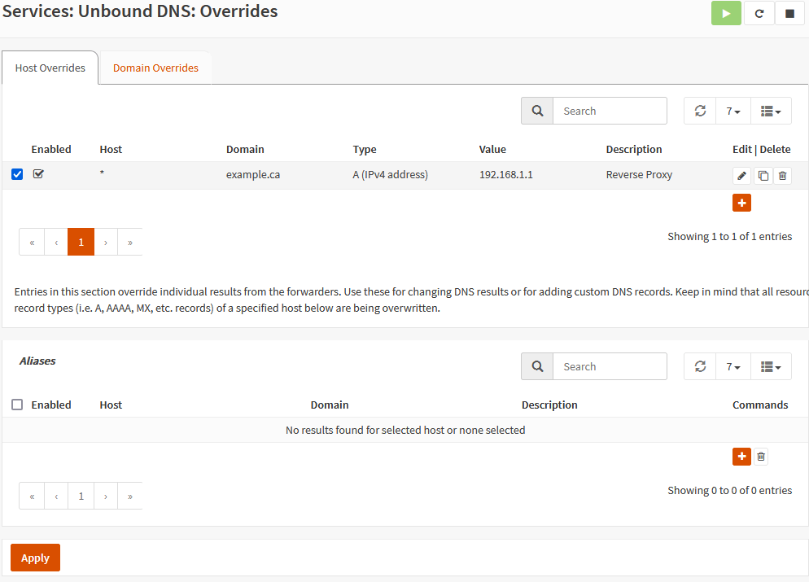
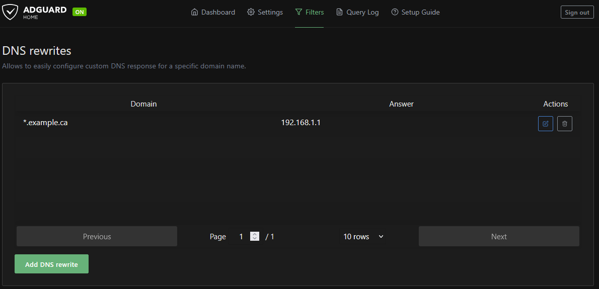
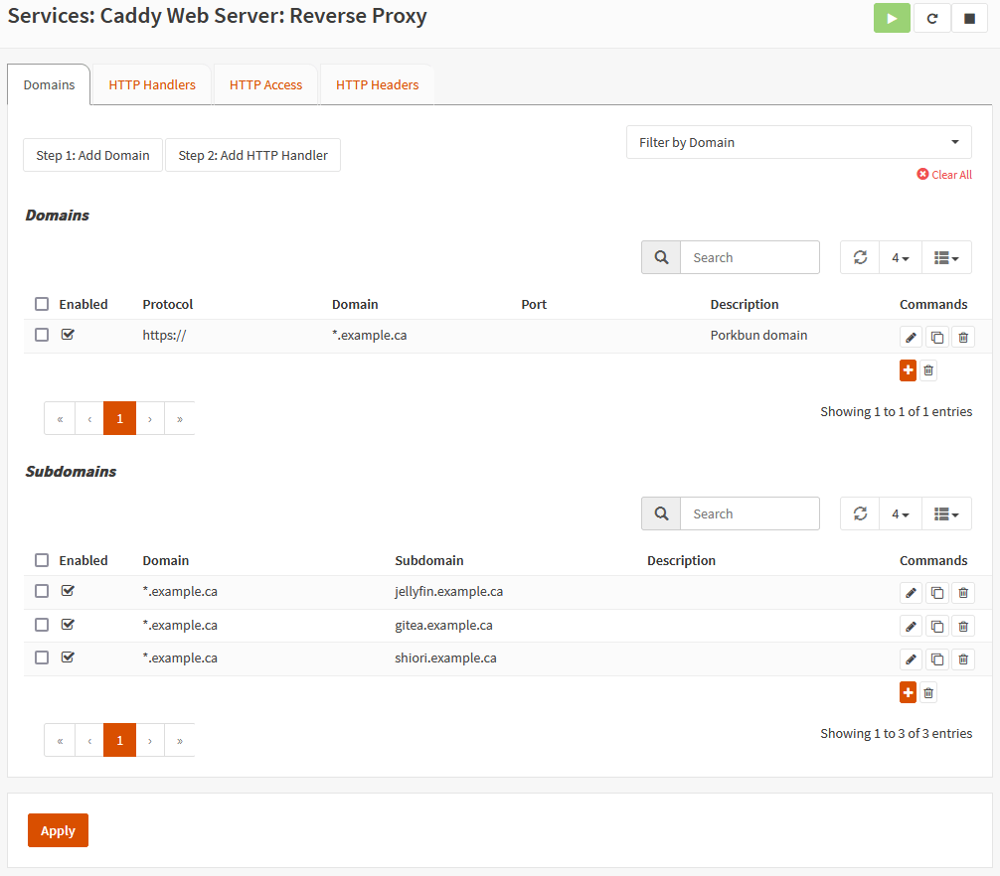
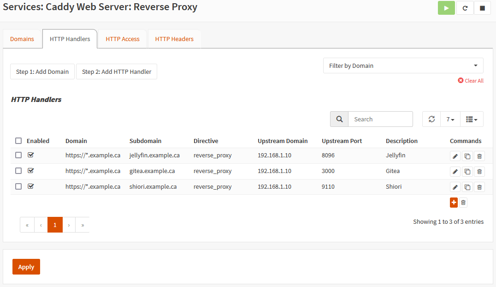

# Caddy Reverse Proxy with Lets Encrypt

It's time to finally get rid of those browser warnings when hosting services using ``HTTP``. We'll setup caddy as an **internal** reverse proxy and use DNS-01 Challenges to get a valid certificates from Let's Encrypt. 

Nothing needs to, or will be exposed from outside our network to achieve this.

We'll use our domain providers' ``(Porkbun)`` to API generate and grab the certs.

This will also enable us to reach our services with friendly names. Instead of going to Gitea with ``192.168.1.10:3000``, we'll do something like ``gitea.example.ca``

# Resources

- [Caddy](https://caddyserver.com/)
- [OPNsense Caddy Guide](https://docs.opnsense.org/manual/how-tos/caddy.html)
- [Porkbun](https://porkbun.com/)
- [Home Network Guy Unbound DNS Overrides](https://homenetworkguy.com/how-to/create-unbound-dns-override-aliases-in-opnsense/)

# Pre-requisites

- AdguardHome working properly with Unbound (Private reverse dns resolvers)
- A domain you own; I have one registered with Porkbun. We'll assume I bought the domain ``example.ca``

- An API Key & Secret Key generated for your domain through Porkbun.

# What is What

I use OPNSense's default DNS resolver ``Unbound`` in conjunction with ``AdguardHome`` for ad-blocking

- Unbound is running on OPNsense with the ip: ``192.168.1.1:5353``
- AdguardHome is running on OPNsense with the ip: ``192.168.1.1:53``
- Caddy will run on OPNsense with the ip: ``192.168.1.1:80`` and ``192.168.1.1:443``

# How To

## Unbound

Follow the guide from Home Network Guy to create the override.

Make sure the IP address is the IP of OPNsense; In my case it is ``192.168.1.1``.

The only change when following the guide is to use a wildcard instead of the service name. In his guide, he entered ``reverse-proxy`` as the host, but we instead will do ``*`` as the host.

Don't create the alias.

## AdguardHome

Since this is internal, we'll need to do a DNS rewrite to tell our DNS server to resolve any requests to ``*.example.ca``.

Under ``Filters -> DNS Rewrites`` Add an entry with ``*.example.ca`` as the domain and ``192.168.1.1`` as the IP.

This will let AdguardHome let Unbound resolve these requests.

## Caddy

1. Start from the [installation](https://docs.opnsense.org/manual/how-tos/caddy.html#installation) but skip creating the **WAN** firewall rule.

2. Then continue following [Creating a Simple Reverse Proxy](https://docs.opnsense.org/manual/how-tos/caddy.html#creating-a-simple-reverse-proxy) but before doing **Add Domain** go to **DNS Provider** and select **Porkbun** as the provider.

    Enter your **API Key** from porkbun into the **DNS API Standard Field** and under **DNS API Additional Field 1** add your **Secret Key** from porkbun.

3. Continue following the guide to add a domain, but make sure to check the **DNS-01 Challenge** box when adding your domain.

4. Stop before **HTTP Handlers**. We'll do something before this.

5. Since we're using wildcards, we'll create subdomains for each of our services. Create a new **Sub-Domain**, and make sure the domain you created before is selected. Name the subdomain whatever you want. e.g if you use a domain called ``*.example.ca`` then your subdomain would be ``gitea.example.ca``

6. Continue creating the **HTTP Handler**, but make sure to select the sub-domain we created in step 5.

7. That should be everything setup now. Caddy should grab the certs and you should now be able to go to ``gitea.example.ca`` and see your gitea instance being served with ``https``.

