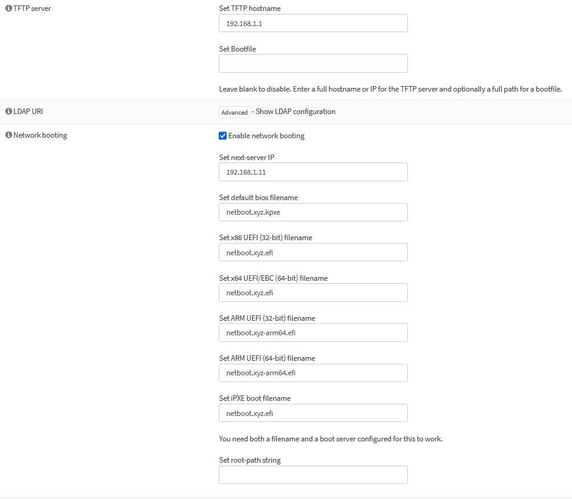

# Network Booting with netboot.xyz & OPNsense

Network booting is useful when you want to image a machine without having to carry around a USB drive. My main use case for setting this up is to eventually netboot raspberry pi's and mount their boot drives over NFS. 

# Resources
- [netboot.xyz](https://netboot.xyz/)
- [General steps to setting up netbooting on OPNsense by u/Asche77](https://old.reddit.com/r/opnsense/comments/1bts98q/opnsensebare_metal_netbootxyzrunning_on_truenas/)
- [In-depth guide on netbooting with OPNsense](https://forum.opnsense.org/index.php?topic=25003.0)
- [Complete netbootxyz/unifi/proxmox guide by TechnoTim](https://technotim.live/posts/netbootxyz-tutorial/)

Related

- [Troubleshooting netbooting within a Proxmox VM](https://old.reddit.com/r/Proxmox/comments/qil7qy/unable_to_pxe_boot_uefibased_vms/)

# What is what

- OPNsense IP is `192.168.1.1`
- TFTP server will be `192.168.1.1`
- DHCP server is `192.168.1.1`
- netbootxyz server is `192.168.1.11`

# How To

## netboot.xyz Docker Setup

1. Setup is pretty easy, just choose your install method. I'll use a docker compose file to install the container on a Debian LXC Container.

```yaml
version: "2.1"
services:
  netbootxyz:
    image: ghcr.io/netbootxyz/netbootxyz
    container_name: netbootxyz
    volumes:
      - ./config:/config
      - ./assets:/assets
    ports:
      - 3000:3000
      - 69:69/udp
      - 8080:80
    restart: unless-stopped
```

## TFTP Server & OPNsense Settings

1. Install the TFTP server on OPNsense by going to [System] -> [Plugin] -> search for `tft`, and install `os-tftp`

2. The server won't start unless the `/usr/local/tftp` directory exists, so create it.

3. Download the netboot.xyz efi files from the [releases page](https://github.com/netbootxyz/netboot.xyz/releases) and place them in the directory you created. You can use the [fetch](https://man.freebsd.org/cgi/man.cgi?fetch(1)) command in freebsd like `fetch https://github.com/netbootxyz/netboot.xyz/releases/download/2.0.82/netboot.xyz.efi`

    I'll download the following:

    - netboot.xyz-arm64.efi
    - netboot.xyz.efi
    - netboot.xyz.kpxe

4. Add your netboot server to your DHCP server by going to [Services] -> [ISC DHCPv4] -> [Interface] -> [Network booting].

5. Add your netboot server under [Services] -> [ISC DHCPv4] -> [Interface] -> [TFTP server].



6. You should be able to now boot from the network